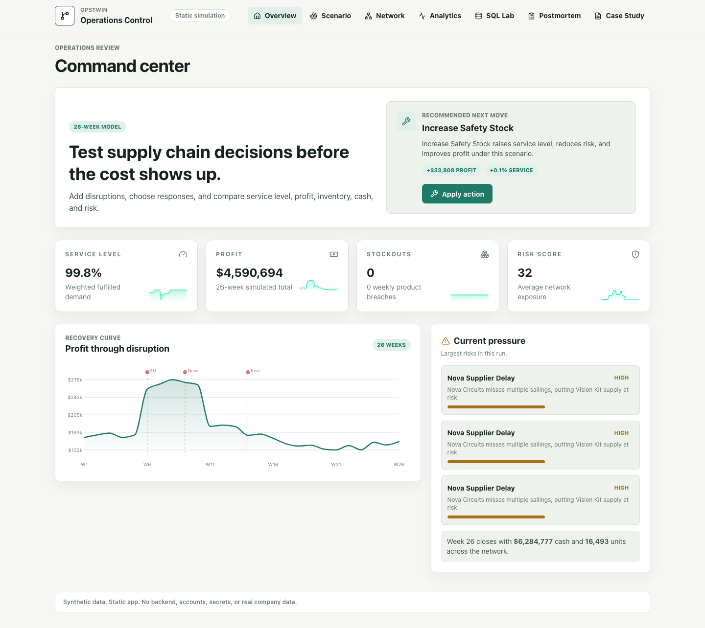

# OpsTwin Control Tower

Professional static SPA that simulates enterprise operations under disruption.

Live site after Pages deployment:

- https://ahmedyassershalaby.github.io/ops-twin-control-tower/

## What It Proves



- Business systems modeling beyond normal dashboards.
- Deterministic operations simulation across suppliers, warehouses, lanes, products, customers, cash, and risk.
- Decision-support UI with disruption scenarios, response playbooks, Monte Carlo comparison, SQL analysis, and postmortems.
- Modern frontend engineering with React, TypeScript, Vite, Tailwind, Zustand, D3, React Flow, DuckDB-Wasm, Vitest, and Playwright.

## Main Routes

- `/` command center
- `/scenario` scenario builder
- `/network` supplier and warehouse graph
- `/analytics` KPI trends and Monte Carlo worker
- `/sql` in-browser DuckDB lab
- `/postmortem` generated recovery report
- `/about` project case study

## Local Run

```bash
npm install
npm run dev
```

## Verification

```bash
npm run lint
npm run typecheck
npm run test
npm run build
npm run test:e2e
```

## Safety

Uses synthetic data only. No secrets, APIs, backend, or real company data.
